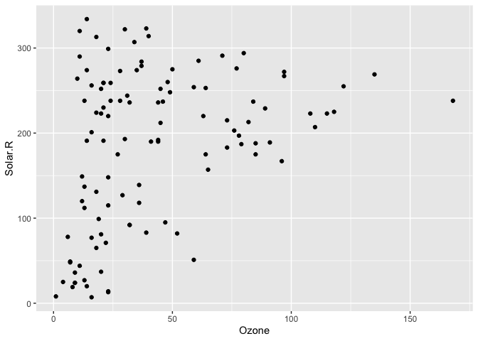
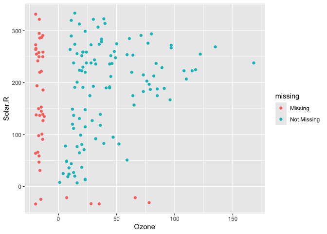
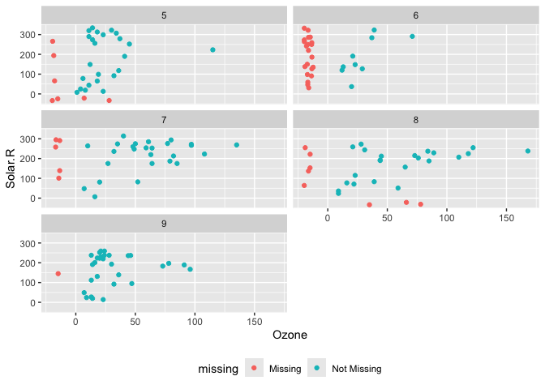
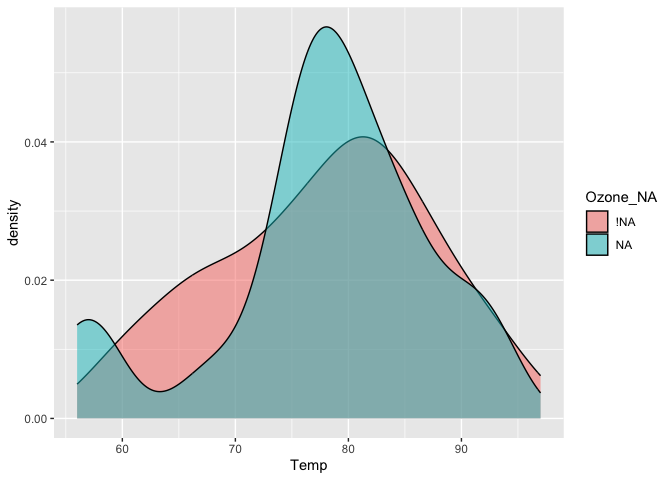
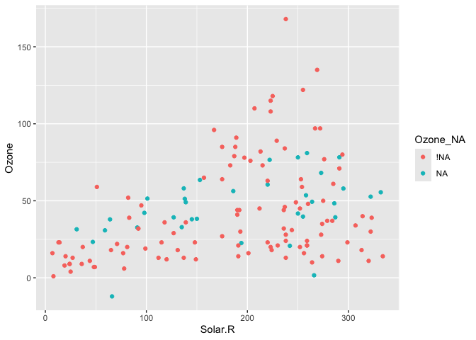
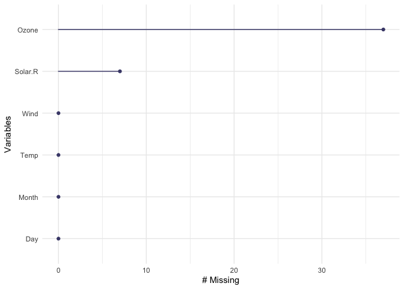
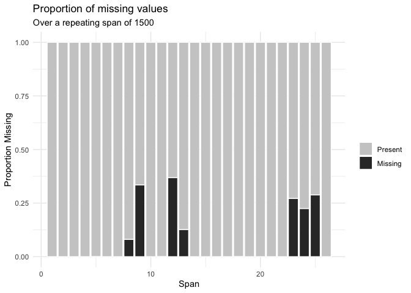

<!-- README.md is generated from README.Rmd. Please edit that file -->

# naniar 

[](https://ci.appveyor.com/project/njtierney/naniar-xb96h)[](https://travis-ci.org/njtierney/naniar)
[](https://codecov.io/github/njtierney/naniar?branch=master)[](https://cran.r-project.org/package=naniar)[](http://cran.rstudio.com/web/packages/naniar/index.html)
[](https://www.tidyverse.org/lifecycle/#maturing)

`naniar` provides principled, tidy ways to summarise, visualise, and
manipulate missing data with minimal deviations from the workflows in
ggplot2 and tidy data. It does this by providing:

  - Shadow matrices, a tidy data structure for missing data:
      - `bind_shadow()` and `nabular()`
  - Shorthand summaries for missing data:
      - `n_miss()` and `n_complete()`
      - `pct_miss()`and `pct_complete()`
  - Numerical summaries of missing data in variables and cases:
      - `miss_var_summary()` and `miss_var_table()`
      - `miss_case_summary()`, `miss_case_table()`
  - Visualisation for missing data:
      - `geom_miss_point()`
      - `gg_miss_var()`
      - `gg_miss_case()`
      - `gg_miss_fct()`

For more details on the workflow and theory underpinning naniar, read
the vignette [Getting started with
naniar](http://naniar.njtierney.com/articles/getting-started-w-naniar.html).

For a short primer on the data visualisation available in naniar, read
the vignette [Gallery of Missing Data
Visualisations](http://naniar.njtierney.com/articles/naniar-visualisation.html).

# Installation

You can install naniar from CRAN:

``` r
install.packages("naniar")
```

Or you can install the development version on github using `remotes`:

``` r
# install.packages("remotes")
remotes::install_github("njtierney/naniar")
```

# A short overview of naniar

Visualising missing data might sound a little strange - how do you
visualise something that is not there? One approach to visualising
missing data comes from [ggobi](http://www.ggobi.org/) and
[manet](https://www.swmath.org/software/3067), which replaces `NA`
values with values 10% lower than the minimum value in that variable.
This visualisation is provided with the `geom_miss_point()` ggplot2 geom
- which we illustrate by exploring the relationship between Ozone and
Solar radiation from the airquality dataset.

``` r

library(ggplot2)

ggplot(data = airquality,
       aes(x = Ozone,
           y = Solar.R)) +
  geom_point()
#> Warning: Removed 42 rows containing missing values (geom_point).
```

<!-- -->

ggplot2 does not handle these missing values, and we get a warning
message about the missing values.

We can instead use `geom_miss_point()` to display the missing data

``` r

library(naniar)

ggplot(data = airquality,
       aes(x = Ozone,
           y = Solar.R)) +
  geom_miss_point()
```

<!-- -->

`geom_miss_point()` has shifted the missing values to now be 10% below
the minimum value. The missing values are a different colour so that
missingness becomes pre-attentive. As it is a ggplot2 geom, it supports
features like faceting and other ggplot features.

``` r

p1 <-
ggplot(data = airquality,
       aes(x = Ozone,
           y = Solar.R)) + 
  geom_miss_point() + 
  facet_wrap(~Month, ncol = 2) + 
  theme(legend.position = "bottom")

p1
```

<!-- -->

# Data Structures

naniar provides a data structure for working with missing data, the
shadow matrix [(Swayne and
Buja, 1998)](https://www.researchgate.net/publication/2758672_Missing_Data_in_Interactive_High-Dimensional_Data_Visualization).
The shadow matrix is the same dimension as the data, and consists of
binary indicators of missingness of data values, where missing is
represented as “NA”, and not missing is represented as “\!NA”, and
variable names are kep the same, with the added suffix “\_NA" to the
variables.

``` r

head(airquality)
#>   Ozone Solar.R Wind Temp Month Day
#> 1    41     190  7.4   67     5   1
#> 2    36     118  8.0   72     5   2
#> 3    12     149 12.6   74     5   3
#> 4    18     313 11.5   62     5   4
#> 5    NA      NA 14.3   56     5   5
#> 6    28      NA 14.9   66     5   6

as_shadow(airquality)
#> # A tibble: 153 x 6
#>    Ozone_NA Solar.R_NA Wind_NA Temp_NA Month_NA Day_NA
#>    <fct>    <fct>      <fct>   <fct>   <fct>    <fct> 
#>  1 !NA      !NA        !NA     !NA     !NA      !NA   
#>  2 !NA      !NA        !NA     !NA     !NA      !NA   
#>  3 !NA      !NA        !NA     !NA     !NA      !NA   
#>  4 !NA      !NA        !NA     !NA     !NA      !NA   
#>  5 NA       NA         !NA     !NA     !NA      !NA   
#>  6 !NA      NA         !NA     !NA     !NA      !NA   
#>  7 !NA      !NA        !NA     !NA     !NA      !NA   
#>  8 !NA      !NA        !NA     !NA     !NA      !NA   
#>  9 !NA      !NA        !NA     !NA     !NA      !NA   
#> 10 NA       !NA        !NA     !NA     !NA      !NA   
#> # … with 143 more rows
```

Binding the shadow data to the data you help keep better track of the
missing values. This format is called “nabular”, a portmanteau of `NA`
and `tabular`. You can bind the shadow to the data using `bind_shadow`
or `nabular`:

``` r
bind_shadow(airquality)
#> # A tibble: 153 x 12
#>    Ozone Solar.R  Wind  Temp Month   Day Ozone_NA Solar.R_NA Wind_NA
#>    <int>   <int> <dbl> <int> <int> <int> <fct>    <fct>      <fct>  
#>  1    41     190   7.4    67     5     1 !NA      !NA        !NA    
#>  2    36     118   8      72     5     2 !NA      !NA        !NA    
#>  3    12     149  12.6    74     5     3 !NA      !NA        !NA    
#>  4    18     313  11.5    62     5     4 !NA      !NA        !NA    
#>  5    NA      NA  14.3    56     5     5 NA       NA         !NA    
#>  6    28      NA  14.9    66     5     6 !NA      NA         !NA    
#>  7    23     299   8.6    65     5     7 !NA      !NA        !NA    
#>  8    19      99  13.8    59     5     8 !NA      !NA        !NA    
#>  9     8      19  20.1    61     5     9 !NA      !NA        !NA    
#> 10    NA     194   8.6    69     5    10 NA       !NA        !NA    
#> # … with 143 more rows, and 3 more variables: Temp_NA <fct>,
#> #   Month_NA <fct>, Day_NA <fct>
nabular(airquality)
#> # A tibble: 153 x 12
#>    Ozone Solar.R  Wind  Temp Month   Day Ozone_NA Solar.R_NA Wind_NA
#>    <int>   <int> <dbl> <int> <int> <int> <fct>    <fct>      <fct>  
#>  1    41     190   7.4    67     5     1 !NA      !NA        !NA    
#>  2    36     118   8      72     5     2 !NA      !NA        !NA    
#>  3    12     149  12.6    74     5     3 !NA      !NA        !NA    
#>  4    18     313  11.5    62     5     4 !NA      !NA        !NA    
#>  5    NA      NA  14.3    56     5     5 NA       NA         !NA    
#>  6    28      NA  14.9    66     5     6 !NA      NA         !NA    
#>  7    23     299   8.6    65     5     7 !NA      !NA        !NA    
#>  8    19      99  13.8    59     5     8 !NA      !NA        !NA    
#>  9     8      19  20.1    61     5     9 !NA      !NA        !NA    
#> 10    NA     194   8.6    69     5    10 NA       !NA        !NA    
#> # … with 143 more rows, and 3 more variables: Temp_NA <fct>,
#> #   Month_NA <fct>, Day_NA <fct>
```

Using the nabular format helps you manage where missing values are in
your dataset and make it easy to do visualisations where you split by
missingness:

``` r

airquality %>%
  bind_shadow() %>%
  ggplot(aes(x = Temp,
             fill = Ozone_NA)) + 
  geom_density(alpha = 0.5)
```

<!-- -->

And even visualise imputations

``` r

airquality %>%
  bind_shadow() %>%
  simputation::impute_lm(Ozone ~ Temp + Solar.R) %>%
  ggplot(aes(x = Solar.R,
             y = Ozone,
             colour = Ozone_NA)) + 
  geom_point()
#> Warning: Removed 7 rows containing missing values (geom_point).
```

<!-- -->

Or perform an [upset](https://www.nature.com/articles/nmeth.3033) plot -
to plot of the combinations of missingness across cases, using the
`gg_miss_upset` function

``` r

gg_miss_upset(airquality)
```

<!-- -->

naniar does this while following consistent principles that are easy to
read, thanks to the tools of the tidyverse.

naniar also provides handy visualations for each variable:

``` r

gg_miss_var(airquality)
```

<!-- -->

Or the number of missings in a given variable at a repeating span

``` r
gg_miss_span(pedestrian,
             var = hourly_counts,
             span_every = 1500)
```

<!-- -->

You can read about all of the visualisations in naniar in the vignette
[Gallery of missing data visualisations using
naniar](http://naniar.njtierney.com/articles/naniar-visualisation.html).

naniar also provides handy helpers for calculating the number,
proportion, and percentage of missing and complete observations:

``` r
n_miss(airquality)
#> [1] 44
n_complete(airquality)
#> [1] 874
prop_miss(airquality)
#> [1] 0.04793028
prop_complete(airquality)
#> [1] 0.9520697
pct_miss(airquality)
#> [1] 4.793028
pct_complete(airquality)
#> [1] 95.20697
```

# Numerical summaries for missing data

naniar provides numerical summaries of missing data, that follow a
consistent rule that uses a syntax begining with `miss_`. Summaries
focussing on variables or a single selected variable, start with
`miss_var_`, and summaries for cases (the initial collected row order of
the data), they start with `miss_case_`. All of these functions that
return dataframes also work with dplyr’s `group_by()`.

For example, we can look at the number and percent of missings in each
case and variable with `miss_var_summary()`, and `miss_case_summary()`,
which both return output ordered by the number of missing values.

``` r

miss_var_summary(airquality)
#> # A tibble: 6 x 3
#>   variable n_miss pct_miss
#>   <chr>     <int>    <dbl>
#> 1 Ozone        37    24.2 
#> 2 Solar.R       7     4.58
#> 3 Wind          0     0   
#> 4 Temp          0     0   
#> 5 Month         0     0   
#> 6 Day           0     0
miss_case_summary(airquality)
#> # A tibble: 153 x 3
#>     case n_miss pct_miss
#>    <int>  <int>    <dbl>
#>  1     5      2     33.3
#>  2    27      2     33.3
#>  3     6      1     16.7
#>  4    10      1     16.7
#>  5    11      1     16.7
#>  6    25      1     16.7
#>  7    26      1     16.7
#>  8    32      1     16.7
#>  9    33      1     16.7
#> 10    34      1     16.7
#> # … with 143 more rows
```

You could also `group_by()` to work out the number of missings in each
variable across the levels within it.

``` r

library(dplyr)
#> 
#> Attaching package: 'dplyr'
#> The following objects are masked from 'package:stats':
#> 
#>     filter, lag
#> The following objects are masked from 'package:base':
#> 
#>     intersect, setdiff, setequal, union
airquality %>%
  group_by(Month) %>%
  miss_var_summary()
#> # A tibble: 25 x 4
#>    Month variable n_miss pct_miss
#>    <int> <chr>     <int>    <dbl>
#>  1     5 Ozone         5     16.1
#>  2     5 Solar.R       4     12.9
#>  3     5 Wind          0      0  
#>  4     5 Temp          0      0  
#>  5     5 Day           0      0  
#>  6     6 Ozone        21     70  
#>  7     6 Solar.R       0      0  
#>  8     6 Wind          0      0  
#>  9     6 Temp          0      0  
#> 10     6 Day           0      0  
#> # … with 15 more rows
```

You can read more about all of these functions in the vignette [“Getting
Started with
naniar”](http://naniar.njtierney.com/articles/getting-started-w-naniar.html).

# Contributions

Please note that this project is released with a [Contributor Code of
Conduct](CONDUCT.md). By participating in this project you agree to
abide by its terms.

# Future Work

  - Extend the `geom_miss_*` family to include categorical variables,
    Bivariate plots: scatterplots, density overlays
  - SQL translation for databases
  - Big Data tools (sparklyr, sparklingwater)
  - Work well with other imputation engines / processes
  - Provide tools for assessing goodness of fit for classical approaches
    of MCAR, MAR, and MNAR (graphical inference from `nullabor` package)

## Acknowledgements

Firstly, thanks to [Di Cook](https://github.com/dicook) for giving the
initial inspiration for the package and laying down the rich theory and
literature that the work in naniar is built upon. Naming credit (once
again\!) goes to [Miles McBain](https://github.com/milesmcbain). Among
various other things, Miles also worked out how to overload the missing
data and make it work as a geom. Thanks also to [Colin
Fay](https://github.com/ColinFay) for helping me understand tidy
evaluation and for features such as `replace_to_na`, `miss_*_cumsum`,
and more.

## A note on the name

naniar was previously named `ggmissing` and initially provided a ggplot
geom and some other visualisations. `ggmissing` was changed to `naniar`
to reflect the fact that this package is going to be bigger in scope,
and is not just related to `ggplot2`. Specifically, the package is
designed to provide a suite of tools for generating visualisations of
missing values and imputations, manipulate, and summarise missing data.

> …But *why* naniar?

Well, I think it is useful to think of missing values in data being like
this other dimension, perhaps like [C.S. Lewis’s
Narnia](https://en.wikipedia.org/wiki/The_Chronicles_of_naniar) - a
different world, hidden away. You go inside, and sometimes it seems like
you’ve spent no time in there but time has passed very quickly, or the
opposite. Also, `NA`niar = na in r, and if you so desire, naniar may
sound like “noneoya” in an nz/aussie accent. Full credit to @MilesMcbain
for the name, and @Hadley for the rearranged spelling.
